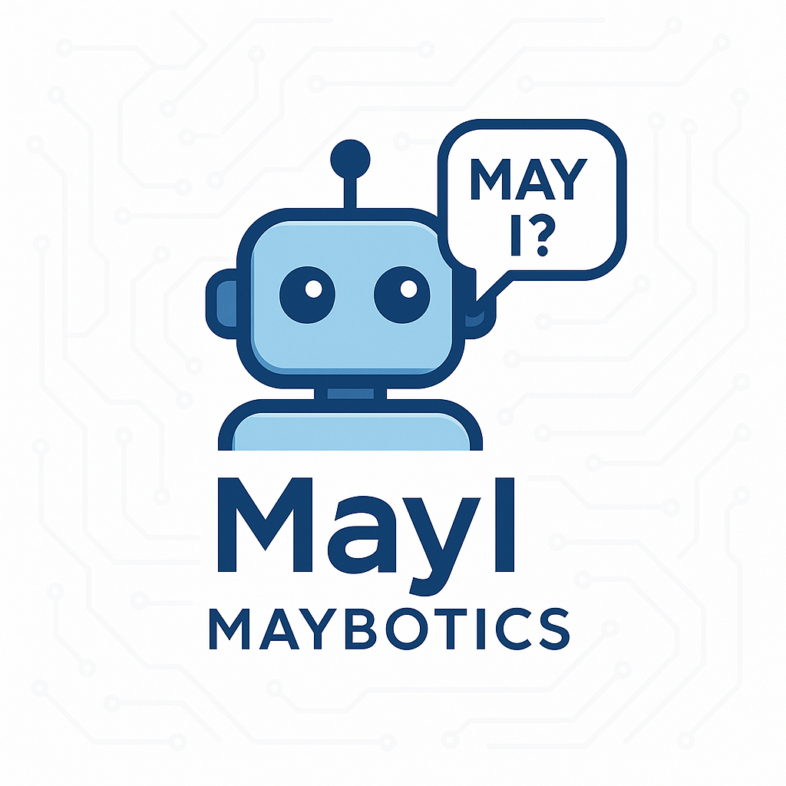

# 🤖 Maybotics - May I?

A LangChain Agent playground exploring tool-using, task-solving AI that thinks before it acts.

<!-- 
 -->
  
<!-- 
 -->

## About

**Maybotics-MayI** is a personal AI lab for building and experimenting with LangChain agents.  
It brings together ReAct-style reasoning, autonomous decision-making, and flexible tool integration.

## Features

- LangChain agent setup (ReAct / Conversational)
- Custom tool integration (e.g., calculator, file reader, API fetcher)
- Memory and contextual awareness
- Modular experiments for agent logic and prompt engineering
